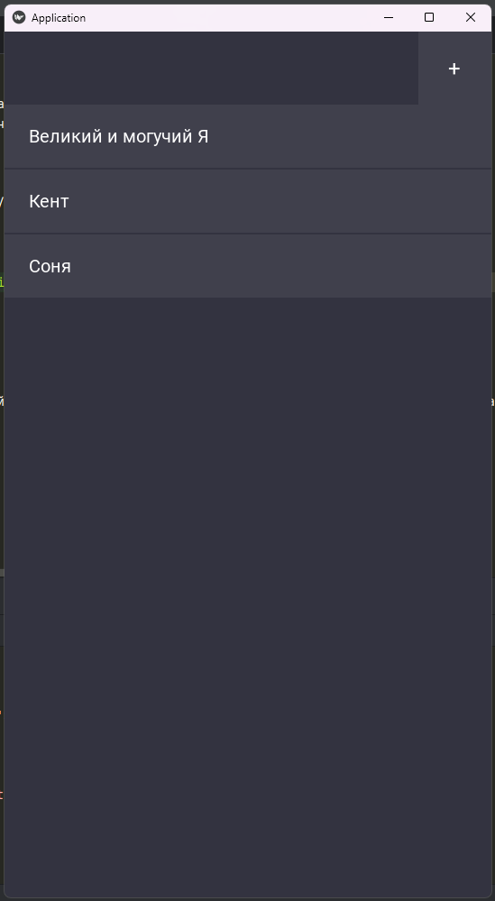
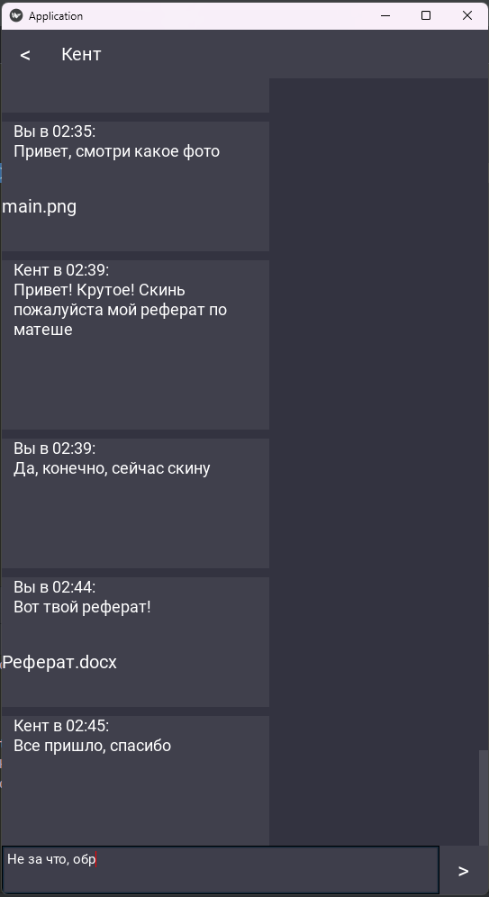
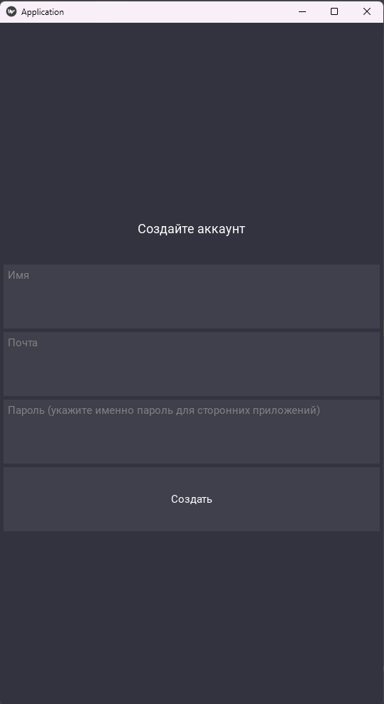
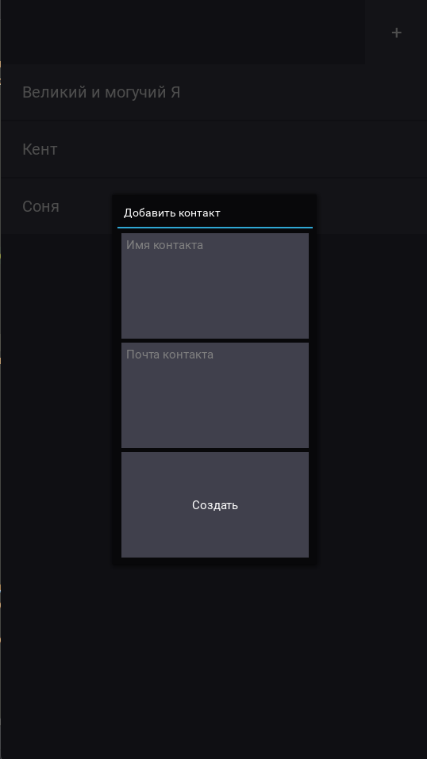

## Физмат Мессенджер

Физмат мессенджер - это кроссплатформенное приложение для обмена сообщениями, файлами.
Это приложение - обертка над почтой: работает как помощник в отправке и получении сообщений с почты

## Автор

Ровенский Николай (INTEGRAL1098/Integral2009)

## Скриншоты







## Возможности

- Хранение контактов и аккаунта
- Отправка и получение сообщений по почте (приложение работает со множеством почтовых сервисов на базе SMPT, IMAP) :
        gmail.com
        yandex.ru
        ya.ru
        mail.ru
        bk.ru
        list.ru
        inbox.ru
        rambler.ru
        yahoo.com
        outlook.com
        hotmail.com
        icloud.com
- Поддержка отправки вложений: Фото, Видео, Аудио и тд...
- История сообщений хранящаяся локально на устройстве на базе sqlite3
- Удобный интерфейс на базе фреймворка kivy
- Автоматическое обновление сообщений в реальном времени

## Структура проекта

Messenger/
- core/
- android_utils/
- handlers/
- network/
- storage/
- ui/
- main.py

В выделенном специальном пути создается

./
- Contacts/
  - [contact]NAME /
    - videos/
    - images/
    - audio/
    - files/
    - ini.json
    - history.db
  - ...
- config.json
- account_config.json


## Возможные планы на проект

- Улучшить ui
- Добавить отображение прикрепленных файлов в виде изображения

## Установка и запуск

Скачать все файлы в отдельный репозиторий на пк

### Требования
- puthon3.10 и выше
- kivy 2.3.1
- ОС Windows/Linux для десктопной сборки, Linux для сборки под android

### Запуск:
В директории с проектом в терминале выполнить
```
python3-m venv .venv
```
```
.venv\Scripts\activate
```
```
pip install kivy==2.3.1
```
```
python3 main.py
```

### Сборка:
### (под WINDOWS и под LINUX)
В той же директории, если не выполнили повторите
```
python3 -m venv .venv
```
```
.venv\Scripts\activate
```
Установите pyinstaller запустите сборку
```
pip install pyinstaller
```
```
pyinstaller --onefile main.py
```
### (под Android) !Собрать можно только на LINUX или вирт. машинах
Подготовьте систему
```
sudo apt update
sudo apt install -y git zip unzip openjdk-17-jdk python3-pip autoconf libtool pkg-config zlib1g-dev libncurses5-dev libncursesw5-dev libtinfo5 cmake libffi-dev libssl-dev automake
```
Установите buildozer
```
pip install buildozer
```
В директории с проектом
```
buildozer init
```
Настройте создавшийся buildozer.spec или оставьте как есть
Запустите сборку в .apk
```
buildozer android debug
```
