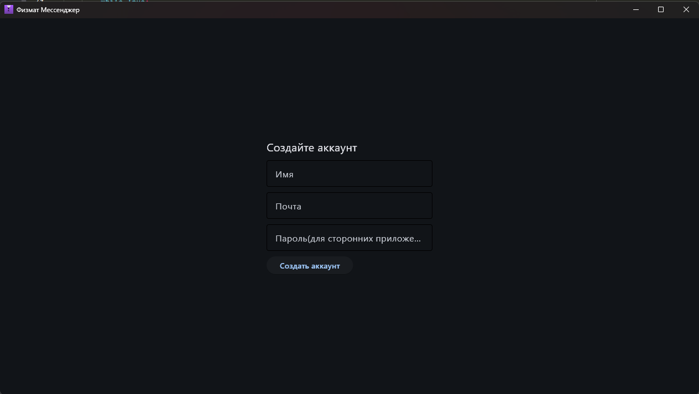
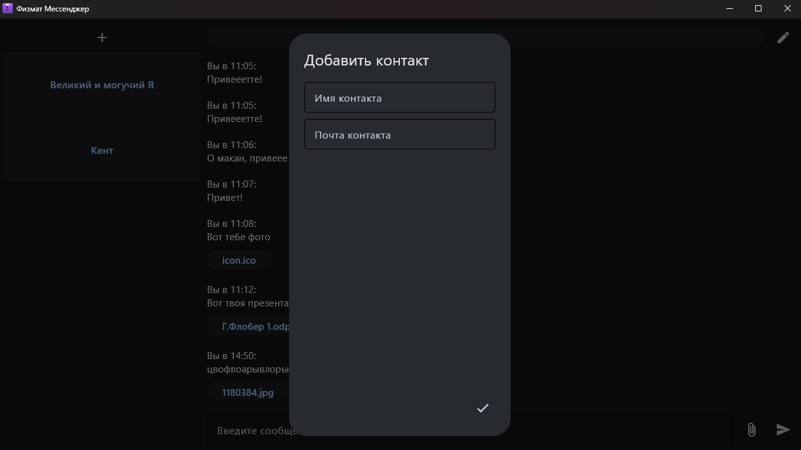
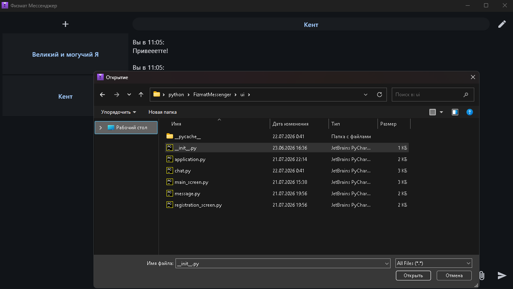
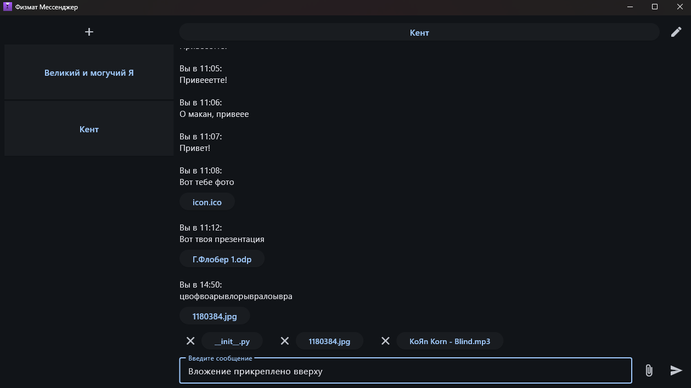

# Почта, превращенная в чат
## Физмат Мессенджер

Физмат мессенджер - это кроссплатформенное приложение для обмена сообщениями, файлами.
Это приложение - обертка над почтой: работает как помощник в отправке и получении сообщений с почты

### Почему стоит выбрать именно этот мессенджер?

Из-за блокировок в РФ и не всегда безопасных способов общения, часто навязываются различного рода государственные сервисы (Тот же МАХ).
Этот мессенджер позволяет обойти блокировки за счет тех же отечественных сервисов, как mail.ru не опасаясь за безопасность своей переписки, благодаря в ближайшем будущем двойному шифрованию почты + самого мессенджера

### На данный момент принято решение о первостепенной разработке под десктоп

## Автор

Ровенский Николай (INTEGRAL1098/Integral2009)

## Скриншоты







## Возможности

- Хранение контактов и аккаунта
- Отправка и получение сообщений по почте (приложение работает со множеством почтовых сервисов на базе SMTP, IMAP) :
        gmail.com
        yandex.ru
        ya.ru
        mail.ru
        bk.ru
        list.ru
        inbox.ru
        rambler.ru
        yahoo.com
        outlook.com
        hotmail.com
        icloud.com
- Поддержка отправки вложений: Фото, Видео, Аудио и тд...
- История сообщений хранящаяся локально на устройстве на базе sqlite3
- Удобный интерфейс на базе фреймворка flet
- Автоматическое обновление сообщений в реальном времени

## Структура проекта

Messenger/
- core/
- android_utils/
- handlers/
- network/
- storage/
- ui/
- main.py

В выделенном специальном пути создается

./
- Contacts/
  - [contact]NAME /
    - videos/
    - images/
    - audio/
    - files/
    - ini.json
    - history.db
  - ...
- config.json
- account_config.json


## Ближайшие цели на проект

### Приложение переписано под flet!
Далее в планах добавить сквозное шифрование сообщений, улучшать работу с почтой, добавить статусы сообщениям
Самое главное сейчас - это оптимизировать работу с imap подключениями, чтобы они создавались лишь 2-3 экземплярами, а не по 2 на каждого контакта

## Установка и запуск

Скачать все файлы в отдельный репозиторий на пк

### Требования

Для запуска из кода
- Python 3.10+
- flet 0.85+
- Windows 10+ ИЛИ
- Linux:
  - Debian: 10, 11, 12
  - Ubuntu: 20.04 LTS, 22.04 LTS, 24.04 LTS

### Запуск:
В директории с проектом в терминале выполнить
```
python3 -m venv .venv
```
```
.venv\Scripts\activate
```
```
pip install flet
```
```
python3 main.py
```

### Сборка:
### (под WINDOWS и под LINUX)
В той же директории, если не выполнили повторите
```
python3 -m venv .venv
```
```
.venv\Scripts\activate
```
В зависимости от системы запустите сборку через flet
```
flet build windows
flet build linux
```